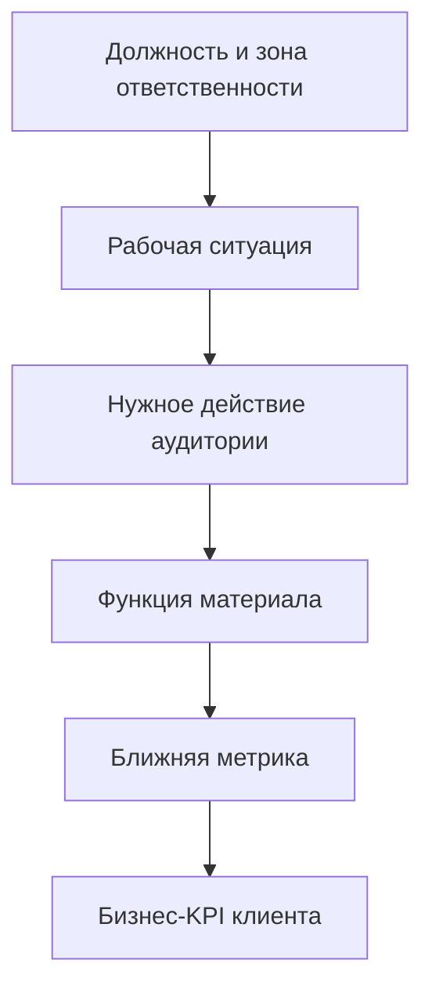

# Должности клиентов, KPI и ценность Anix

Карта ЛПР, пользователей и согласующих

Названия должностей и KPI различаются между компаниями. Таблицы ниже — гипотезы для discovery, а не утверждение о мотивации конкретного человека. До презентации продавец должен спросить: **«За какой результат лично отвечаете вы и как его сейчас измеряют?»**

## Как связывать продукт с KPI

Ролик непосредственно управляет только частью цепочки. Чем дальше метрика от просмотра и действия, тем больше других факторов. Поэтому Anix обещает **спроектировать влияние и измерение**, а не гарантировать коммерческий или safety-результат одним материалом.

## Комитет покупки

| Роль в сделке | Что выяснить | Чем помочь |
|---|---|---|
| Владелец проблемы | где процесс реально не работает | показать точный use case и цену бездействия |
| Инициатор | почему задача возникла сейчас | собрать пилот под живой триггер |
| Бюджетодержатель | какую статью и эффект защищает | связать scope с KPI и продолжением |
| Пользователь материала | где и как будет применять | встроить asset в реальную точку контакта |
| Содержательный валидатор | что нельзя исказить | раннее согласование фактуры и критериев |
| Технический / регуляторный блокер | какие данные, права и правила критичны | зафиксировать ограничения до production |
| Закупки / финансы | как сравнить предложение и ограничить риск | прозрачные deliverables, этапы, права и change request |

## Фарма

| Должность | Вероятные KPI / задачи | Что мешает | Как помогает Anix | Первый вопрос |
|---|---|---|---|---|
| Brand / Product Manager | запуск в срок, выполнение brand plan, HCP engagement, использование материалов полем | сложный тезис, много согласующих, поздние правки | master + версии, визуальная модель, ранний storyboard | «Какая часть brand plan зависит от этого материала и к какой дате?» |
| Marketing Director / TA Lead | результаты портфеля, качество кампаний, скорость go-to-market, предсказуемость бюджета | разрозненные подрядчики и одноразовые активы | единый pipeline при разных бренд-образах, библиотека активов | «Где производство по портфелю теряет больше всего времени или денег?» |
| Medical Affairs / Medical Manager | качество scientific exchange, stakeholder engagement, launch readiness, содержательная корректность | маркетинг упрощает, данные трудно объяснить, нет единой версии | научный research, визуализация причинности, утверждение до анимации | «Какой научный вывод аудитория должна понять без потери оговорок?» |
| Omnichannel / Digital Lead | reach нужного сегмента, engagement, completion, переход к следующему контенту | один master не адаптирован под канал | cut-down, вертикали, modular assets, единая логика кампании | «Какой следующий шаг должен сделать HCP в этом канале?» |
| Sales Excellence / Field Force Training | готовность поля, единое сообщение, использование материалов, time-to-readiness | представители объясняют по-разному | visual sales story, модули и тренировка пересказа | «Что представитель должен уметь объяснить после обучения?» |
| Regulatory / Legal | отсутствие недопустимых claims, traceability согласований, соблюдение сроков review | формулировки и метафоры появляются слишком поздно | claim map, storyboard review, журнал решений | «Какие формулировки и визуальные трактовки запрещены заранее?» |

### Что реально измерять в фарме

- срок от утверждённого брифа до готового master;
- число возвратов из-за новых, а не производственных требований;
- доля адаптаций, собранных из утверждённого master;
- досмотр и переход к следующему шагу в конкретном канале;
- использование asset полевой командой;
- pre/post-понимание ключевого сообщения;
- для Medical Affairs — качество и полезность взаимодействия, а не только объём активностей.

::: warning Регуляторная граница
Продавец не формирует медицинские claims и не гарантирует одобрение. В международной практике promotion должна быть правдивой, сбалансированной и подтверждённой; применимые требования определяют рынок и функции клиента.
:::

## HSE, охрана труда и производство

| Должность | Вероятные KPI / задачи | Что мешает | Как помогает Anix | Первый вопрос |
|---|---|---|---|---|
| Директор по HSE / ОТиПБ | leading и lagging indicators, качество программы, критические риски | формальное прохождение не показывает безопасное действие | сценарные модули, проверка понимания, план измерения | «Какое конкретное безопасное действие сейчас выполняют нестабильно?» |
| Локальный HSE-руководитель | допуск, обучение, наблюдения, закрытие корректирующих действий | повторные объяснения, разные группы и языки | объектный модуль, карточки, мультиязычные версии | «Где в последнем допуске возникли повторы или ошибки?» |
| Директор площадки / производства | безопасный запуск, простои, готовность подрядчиков, выполнение плана | обучение конкурирует со сроками и операциями | короткий обязательный минимум до выхода, повторное использование | «Какой срок или операция находятся под риском из-за неподготовленности?» |
| Руководитель подрядчиков / ремонта | скорость допуска, готовность групп, меньше возвратов | новая аудитория и короткое окно подготовки | серия перед выходом + простая проверка | «Сколько групп и когда должны быть готовы к первому выходу?» |
| L&D / учебный центр | completion, learning gain, перенос в работу, стоимость обновления | длинные курсы и устаревающий контент | microlearning, модульные обновления, pre/post | «Что нужно проверить кроме факта прохождения?» |
| Центральная HSE-функция | единые стандарты и масштабирование между объектами | либо всё слишком общее, либо каждый объект делает заново | visual bible + общее ядро + локальные модули | «Что должно быть единым, а что обязательно локализуется?» |

### KPI HSE, на которые можно опираться

| Уровень | Примеры | Роль Anix |
|---|---|---|
| Доставка | охват, completion, доступность по языкам | формат и канал доставки |
| Понимание | прирост ответа, ошибки по критическому сценарию | визуальная модель и проверка |
| Поведение | наблюдаемое безопасное действие, near-miss reporting, соблюдение процедуры | сценарий и reinforcement; не единственный фактор |
| Процесс | время допуска, число повторных объяснений, срок закрытия корректирующих действий | стандартизация коммуникации |
| Итог | травмы, заболевания, простой | отслеживать, но не приписывать одному ролику без дизайна исследования |

OSHA рекомендует сочетать leading indicators — превентивные признаки качества программы — и lagging indicators, отражающие уже произошедшие события. Это делает разговор с HSE сильнее, чем обещание «снизим травматизм роликом».

## MedTech

| Должность | Вероятные KPI / задачи | Что мешает | Как помогает Anix | Первый вопрос |
|---|---|---|---|---|
| Founder / CEO | revenue, runway, стратегические пилоты, доверие рынка | продукт держится на личном объяснении | фиксирует сильный narrative и делает его пересылаемым | «Какая активная сделка сейчас больше всего зависит от вашего личного объяснения?» |
| CRO / Commercial Director | pipeline, win rate, длина цикла, forecast, средний чек | интерес не превращается в demo или пилот | asset под конкретный этап и stakeholder | «На каком переходе сделки чаще всего застревают?» |
| Head of Sales / BD | встречи, demo-to-pilot, скорость follow-up, использование контента | разные продавцы объясняют workflow по-разному | visual sales kit + talk track + follow-up asset | «Что должен сделать клиент после просмотра?» |
| Product Marketing | message clarity, launch readiness, adoption, sales confidence | функция понятна только продуктовой команде | позиционирование через clinical workflow и use case | «Какую мысль продавцы сегодня пересказывают неточно?» |
| Product / Clinical Lead | корректность workflow, adoption, feedback, implementation readiness | ролик быстро устаревает или искажает клинический смысл | устойчивое ядро + заменяемые UI-сцены + clinical review | «Какая часть продукта устойчива, а какая изменится в следующем релизе?» |
| Event / Marketing Lead | встречи и квалифицированные follow-up после события | красивый экран не продолжает продажу | hero + booth loop + cut-down + post-event asset | «Как вы свяжете просмотр на стенде со следующей встречей?» |

### Метрики MedTech sales asset

- доля целевых контактов, дошедших до demo / второй встречи;
- время от первого разговора до следующего шага;
- число пересылок и новых участников со стороны клиники;
- demo-to-pilot и pilot-to-procurement — как совместные метрики воронки;
- использование asset продавцами;
- правильность пересказа clinical workflow;
- срок обновления материала после изменения продукта.

Не отбирать как ядро ICP ранние стартапы без продаж клиникам, активного use case и коммерческого триггера. Event-роль без sales-контекста тоже недостаточна.

## Сложный B2B, SaaS и технологии

| Должность | Вероятные KPI / задачи | Что мешает | Как помогает Anix | Первый вопрос |
|---|---|---|---|---|
| Founder / CEO | pipeline, крупные сделки, fundraising / partnerships, время экспертов | все ключевые презентации завязаны на основателе | масштабируемое объяснение для первого касания и встречи | «Какую часть каждой продажи вы вынуждены объяснять лично?» |
| VP Sales / Head of Sales | win rate, sales cycle, quota attainment, average deal size | продавцы не создают единую картину ценности | explainer, ролевые версии, enablement | «На каком этапе понимание клиента перестаёт двигать сделку?» |
| Product Marketing Manager | messaging, launch, competitive win/loss, sales confidence, adoption | deck перечисляет функции, а не outcome | narrative, use-case modules, внутренний launch kit | «Какую фразу клиент должен суметь пересказать коллеге?» |
| Marketing / Demand Gen | qualified pipeline, conversion, engagement, CAC efficiency | трафик приходит, но сложность продукта не раскрывается | landing explainer, campaign cut-down, A/B-ready версия | «Какое действие после контента считается квалифицированным?» |
| Sales Enablement | adoption контента, readiness, ramp time, эффективность команды | материалы сложно найти, использовать и адаптировать | один master + playbook использования + training module | «Какая доля команды реально использует нынешние материалы?» |
| Customer Success / Implementation | time-to-value, adoption, expansion, повторные вопросы | обещание продажи не совпадает с пониманием внедрения | onboarding / workflow-модули и единая модель | «Какой вопрос после продажи повторяется чаще всего?» |

Salesforce относит к типичным sales KPI win rate, длину цикла, quota attainment и другие показатели воронки. Anix влияет на них опосредованно, поэтому сначала измеряются использование asset и переход, для которого он создан.

## Корпоративное обучение, HR и внутренние коммуникации

| Должность | Вероятные KPI / задачи | Что мешает | Как помогает Anix | Первый вопрос |
|---|---|---|---|---|
| Head of L&D / корпоративный университет | completion, learning gain, transfer, time-to-competence, стоимость на участника | курсы проходят, но не применяют | модули вокруг действия, практика и проверка | «Какое рабочее поведение является результатом программы?» |
| HRD / People Lead | onboarding speed, engagement, retention, готовность к изменениям | единое сообщение не учитывает роли и контекст | onboarding-серия, change-story, ролевые адаптации | «Что новый сотрудник должен сделать раньше и увереннее?» |
| Internal Communications | reach, понимание, доверие, намерение действовать, участие | коммуникацию доставили, но не поняли | визуальная история + channel versions + CTA | «Какое действие докажет, что сообщение не просто увидели?» |
| Руководитель функции / SME | качество выполнения процесса, ошибки, скорость внедрения изменения | знания остаются в регламенте или у эксперта | визуализирует процесс и типовые ошибки | «Какую ошибку вы объясняете команде снова и снова?» |
| LMS / Learning Operations | доступность, completion, отчётность, скорость обновления | тяжёлый монолитный курс дорого менять | модульная библиотека и отдельные обновления | «Что меняется чаще: содержание, аудитория или система доставки?» |

Модель Kirkpatrick разделяет Reaction, Learning, Behavior и Results. Для Anix это практическое правило: не останавливаться на «понравилось» и completion, а заранее проектировать проверку понимания и переноса в действие.

## Как Anix закрывает KPI: карта продуктов

| Продукт | Ближняя задача | Прямые метрики | Более дальние KPI, где Anix — один из факторов |
|---|---|---|---|
| AI hero film | привлечь и удержать внимание | reach, play, completion, branded search / direct response | awareness, qualified pipeline |
| Product explainer | создать понятную модель | completion, comprehension, CTA conversion | signup, meeting conversion, sales cycle |
| Visual Sales Kit | помочь продавцу получить следующий шаг | seller adoption, asset-assisted meeting, time-to-next-step | win rate, pipeline velocity |
| Pharma HCP package | донести утверждённое сообщение по каналам | использование полем, HCP engagement, message recall | launch performance, stakeholder impact |
| Patient communication | сделать путь и действие понятными | comprehension, completion, переход к источнику / действию | adherence и health outcomes только в системе вмешательств |
| HSE critical-rule series | усилить конкретное безопасное действие | learning gain, scenario accuracy, observed behavior | incidents и downtime только как системные KPI |
| Corporate microlearning | перенести знание в работу | completion, learning, behavior check, time-to-competence | качество, productivity, retention |
| Mascot system | повысить узнаваемость и связность серии | recognition, engagement, reuse rate | культура, доверие, долгосрочный recall |
| Event visual package | превратить событие в следующий шаг | scans, meetings, qualified follow-up, asset reuse | influenced pipeline |
| R&D sprint | снять creative / technical risk | утверждённый treatment, test-shot pass, скорость решения | сокращение риска и переделок полного production |

## Пять вопросов любому ЛПР

1. За какой результат лично отвечаете вы?
2. Как выглядит baseline сейчас?
3. Какое действие аудитории сильнее всего связано с этим результатом?
4. Где именно материал появится в процессе?
5. Какие данные через 2–6 недель покажут, что стоит продолжать?

## Источники и рамки

- [OSHA: Leading Indicators](https://www.osha.gov/leading-indicators) — превентивные показатели safety-программы.
- [OSHA: Program Evaluation](https://www.osha.gov/safety-management/program-evaluation) — сочетание leading и lagging indicators.
- [NIOSH: Effectiveness of Workplace Training](https://www.cdc.gov/niosh/bulletin/2010/workplace-training.html) — влияние обучения и граница причинного обещания.
- [MAPS: Field Medical Metrics / KPIs](https://medicalaffairs.org/position-paper-field-medical-metrics-kpis/) — измерение внешней и внутренней работы Medical Affairs.
- [FDA OPDP](https://www.fda.gov/about-fda/cder-offices-and-divisions/office-prescription-drug-promotion-opdp) — truthful, balanced and accurate prescription drug promotion.
- [Salesforce: Sales KPIs](https://www.salesforce.com/sales/performance-management/sales-kpis/) — типовые метрики продаж.
- [Kirkpatrick Model](https://www.kirkpatrickpartners.com/the-kirkpatrick-model/) — Reaction, Learning, Behavior, Results.
- [AMEC Integrated Evaluation Framework](https://amecorg.com/amecframework/home/) — переход от outputs к пониманию, отношению, действию и impact.

**Связанные материалы:** [возражения](/sales/objections) · [измерение эффекта](/expertise/measurement) · [вопросы по ролям](/sales/discovery-by-role) · [продуктовая линейка](/products/)
